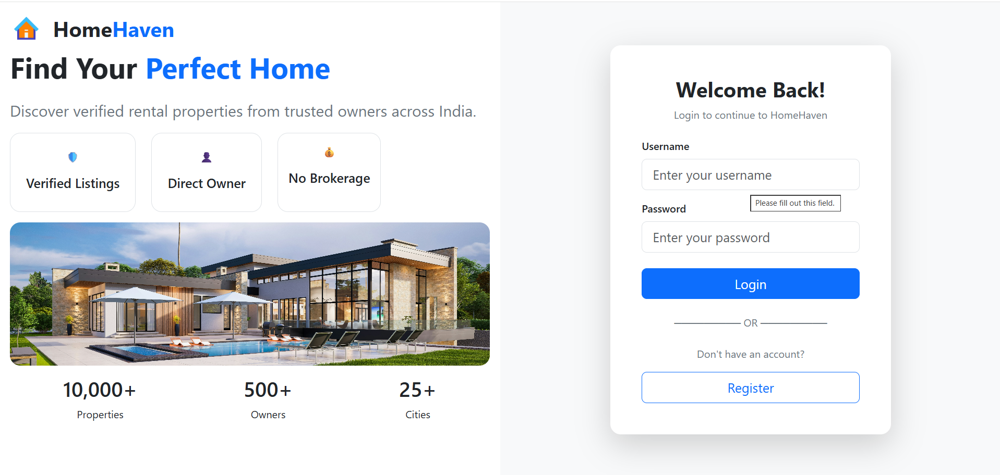
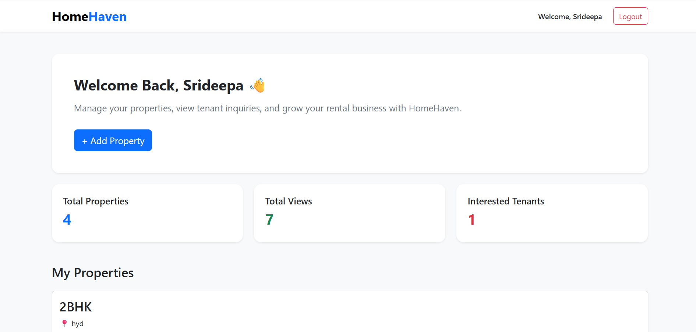
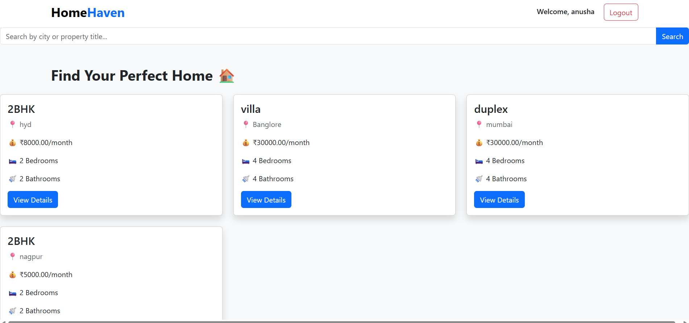
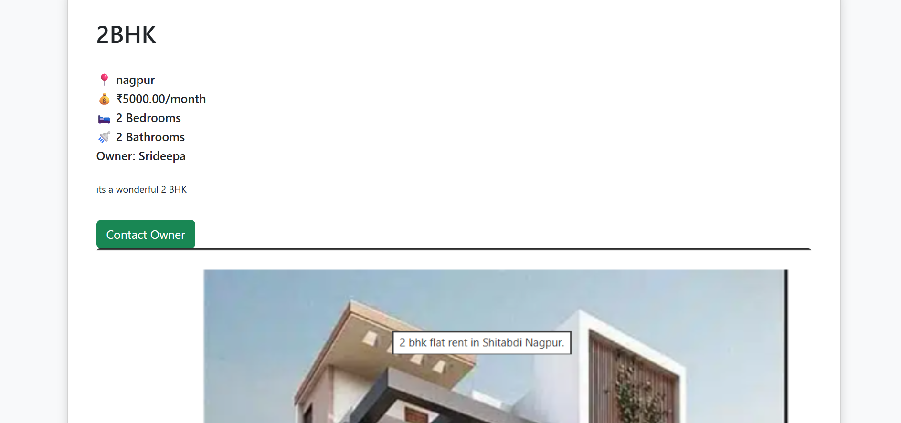
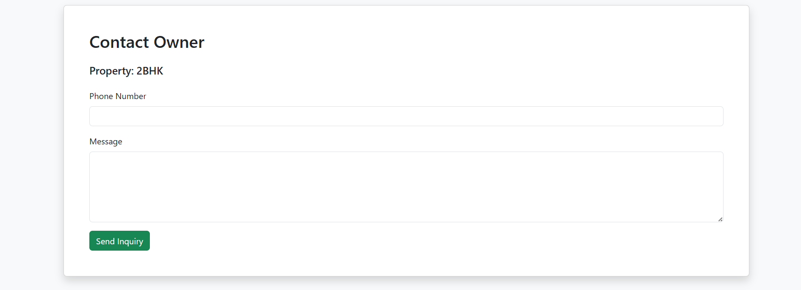

# 🏠 HomeHaven

HomeHaven is a Rental Property Management System built using **Django**, **Python**, **HTML**, **CSS**, **Bootstrap**, and **SQLite**. It allows property owners to list rental properties and tenants to search, view, and send inquiries.

---

## 🚀 Features

### 👤 Authentication
- User Registration
- User Login & Logout
- Owner and Tenant Roles

### 🏠 Owner Features
- Add Property
- Edit Property
- Delete Property
- Upload Property Images
- Mark Property as Available / Occupied
- View Total Properties
- View Total Property Views
- View Interested Tenants
- Dashboard with statistics

### 🏡 Tenant Features
- Browse Available Properties
- Search Properties by City
- View Property Details
- Contact Property Owner
- Send Inquiry with Phone Number and Message

---

## 🛠️ Technologies Used

- Python
- Django
- HTML5
- CSS3
- Bootstrap 5
- SQLite

---

## 📂 Project Structure

```
HomeHaven/
│── accounts/
│── core/
│── properties/
│── media/
│── homehaven/
│── manage.py
```

---

## ⚙️ How to Run

1. Clone the repository

```bash
git clone https://github.com/srideepavanamala-eng/HomeHaven.git
```

2. Install dependencies

```bash
pip install -r requirements.txt
```

3. Run migrations

```bash
python manage.py migrate
```

4. Start the server

```bash
python manage.py runserver
```

Open:

```
http://127.0.0.1:8000/
```

---

## 📸 Screenshots

*(Screenshots will be added soon.)*

### 🏠 Login Page



---

### 👤 Owner Dashboard



---

### 🏡 Tenant Dashboard



---

### 📄 Property Details



---

### 📞 Contact Owner


---

## 👩‍💻 Author

**Srideepa Vanamala**

GitHub: https://github.com/srideepavanamala-eng
